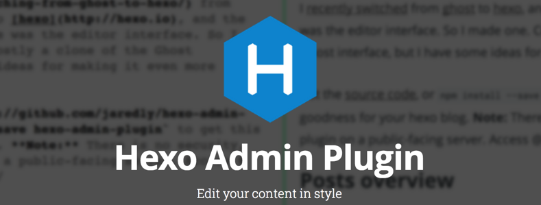

[Hexo博客引擎](http://hexo.io)的管理 UI。基于[Ghost](http://ghost.org)界面，灵感来自svbtle和 prose.io。

## Hexo 版本

对于 2.x，请使用此插件的 0.3.0 版本。版本 1.x 及更高版本仅支持 Hexo v3.x。

### 内容
- [**截图**](#截图)
- [**快速开始**](#快速开始)
- [**致谢**](#致谢)

# 本地使用与部署
这个插件最初被设计为一个本地编辑器——你在本地运行hexo，使用'hexo-admin'来创作帖子，然后使用'hexo generate'或'hexo deploy'将生成的静态HTML文件发送到github页面或其他静态服务器。

但是，“hexo-admin”可以在您的实时博客上运行，只要您使用非静态托管服务，例如Heroku，DigitalOcean等。静态托管服务（如 Github 页面和 Surge.sh）不支持从您的实时站点运行 hexo-admin。
如果您使用的是实时博客中的Hexo管理员，则绝对应该设置密码（见下文） - 否则任何人都可以编辑您的内容。

# 截图


# 快速开始
### 1. 部署 hexo & 创建一个博客
```sh
npm install -g hexo
cd ~/
hexo init blog
cd blog
npm install
```
### 2. 安装插件 & 启动服务
```sh
npm install --save hexo-admin-sch
hexo server -d
open http://localhost:4000/admin/
```
### 3. 完成！
UI应该很容易被发现 - 如果你找不到什么，请告诉我。

### 4. 密码保护
如果您在实时服务器上使用Hexo管理员，则需要一些密码
保护。要启用此功能，您只需向 hexo 添加一些配置变量即可
`_config.yml`:

```
admin:
  username: myfavoritename
  password_hash: be121740bf988b2225a313fa1f107ca1
  secret: a secret something
```

`password_hash`是密码的加密哈希。使用`secret`
为了使 cookie 安全，因此最好让它很长并且复杂。

Hexo 管理员设置中的实用程序可以散列您的密码并生成“管理员”
部分为您。启动Hexo并转到`设置>设置身份验证`
并填写您的信息。将生成的 YAML 复制到您的`_config.yml`中。

一旦到位，启动你的Hexo服务器，然后转到`/admin/`将
要求您输入密码。

### 5. 自定义文章元数据
要使用管理界面添加和编辑您自己的帖子元数据，请添加
元数据变量和自定义变量到您的 hexo `_config.yml`：
```
metadata:
  author_id: defaultAuthorId
  language:
```
您可以提供将用于初始化元数据的默认值
新职位。这些可以是基元或数组。

### 6. 贡献
- 让我知道如何在 [Gitee
  issues](https://gitee.com/schlibra/hexo-admin-sch/issues)
- [fork](https://gitee.com/schlibra/hexo-admin-sch) 和拉取请求

# 致谢

由 [Jared Forsyth](http://jaredly.github.io)
([@jaredforsyth](http://twitter.com/jaredforsyth))构建，使用
[react](http://facebook.github.io/react), [browserify](
http://browserify.org), 和 [less](http://lesscss.org).
