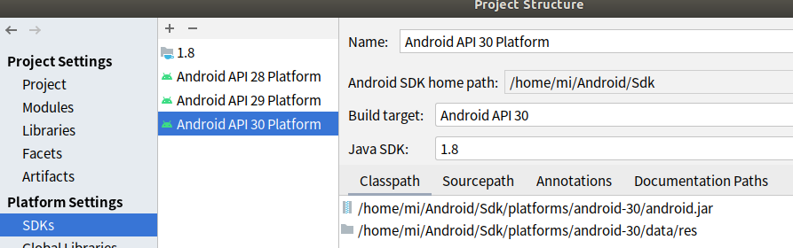
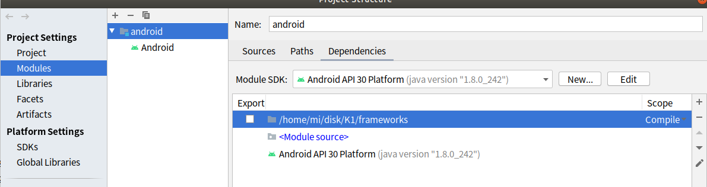

# AOSP+kernel源码和编译（akita-kernel）

## 源码结果和清单文件
### 仓库结构
```
AOSP 根
├─ .repo/                         # repo 工具本地存放
│  └─ manifests/                 # 拉下来的 manifest 集
│     └─ default.xml            # 真正被 repo 使用的清单
└─ 各项目仓库...
```
* default.xml 在哪？
在 platform/manifest 仓库（被 repo init -u ... 同步到本地的 .repo/manifests/default.xml）。
* kernel/superproject 是什么？
不是具体内核源码树，而是 聚合/汇总性 superproject，方便跨内核仓库统一索引与依赖组织。
* kernel 分支名示例：common-android14-6.1-2025-09
	• common：Android 通用内核线（ACK）
	• android14：目标 Android 版本
	• 6.1：基于的 Linux LTS 主版本
	• 2025-09：时间标识（当期发布/对齐月份）
platform manifest 和 kernel manifest
https://android.googlesource.com/platform/manifest
https://android.googlesource.com/kernel/manifest/
### 内核分层
GKI（Generic Kernel Image）引入后，内核架构简化：
```text
Upstream Linux LTS (e.g. v6.1.y)
          │
          ▼
Android Common Kernel  →  kernel/common（Google 维护的通用内核基线）
          │
          ├─ kernel/msm         （Qualcomm 平台下游）
          ├─ kernel/mediatek    （MTK 平台下游）
          ├─ kernel/exynos      （Samsung 平台下游）
          └─ google-modules/*   （Pixel/通用模块）
          │
          ▼
Device Kernel（具体机型仓库/补丁/设备树/配置）
```

#### Android 12「以上」vs「以下」：系统与内核交付形态
| 维度 | Android 12 以下 | Android 12 及以上（GKI 引入后） |
|------|----------------|--------------------------------|
| **系统架构** | Treble 初步拆分：`system` 与 `vendor` 分区，接口解耦还不完全稳定 | Treble 成熟化 + GKI 引入，Google 与厂商职责边界更清晰 |
| **内核来源** | 厂商/机型维护的 **定制内核**（基于 `kernel/[platform]` + device patch） | Google 提供的 **GKI Kernel（通用内核）**，厂商不再维护完整内核 |
| **厂商职责** | 在 `kernel/[platform]` 内核上整合 SoC 驱动、设备树、机型补丁 | 仅需提供 **vendor 内核模块（ko）** 与 **设备树（dtb/dtbo）** |
| **boot.img 内容** | 含厂商定制内核 + ramdisk + dtb | 含 GKI 内核 + ramdisk（设备差异化部分不再直接内置） |
| **模块落盘** | modules 分散在 system/vendor，或直接打包进 boot | 模块单独放入 `vendor_dlkm.img` / `system_dlkm.img` |
| **设备树 (DTB/DTBO)** | 编译进内核镜像，或单独打包进 dtbo.img | 依然由厂商编译，但与 GKI 兼容，放入 dtbo.img |
| **兼容性保障** | 系统更新需强依赖厂商内核同步更新，成本高 | Google 维护 GKI 内核 ABI 稳定性；厂商只需更新 vendor 模块即可 |
| **更新模式** | Kernel Patch + Device Kernel OTA | GKI 内核由 Google 维护安全补丁；厂商仅推 vendor 模块更新 |

#### Android 12 以下（厂商定制内核）
```text
                ┌───────────────────┐
                │   Upstream Linux  │
                └─────────┬─────────┘
                          │
                          ▼
                ┌───────────────────┐
                │ kernel/common     │  ← Google 通用内核
                └─────────┬─────────┘
                          │
        ┌─────────────────┴──────────────────┐
        ▼                                    ▼
┌───────────────┐                  ┌────────────────┐
│ kernel/msm    │                  │ kernel/mediatek│
│ (Qualcomm)    │ ...              │ (MTK)          │ ...
└───────┬───────┘                  └────────┬───────┘
        │                                   │
        ▼                                   ▼
 ┌───────────────┐                     ┌───────────────┐
 │ Device Kernel │ ←小米/厂商叠加机型补丁 │ Device Kernel | 
 └───────┬───────┘                     └───────┬───────┘
         │                                     │
         ▼                                     ▼
 ┌────────────────────────────────────────────────────┐
 │         boot.img                                   │
 │  = 内核镜像 + ramdisk + dtb                         │
 └────────────────────────────────────────────────────┘
```

#### Android 12 及以上（GKI 模式）
```text
                ┌───────────────────┐
                │   Upstream Linux  │
                └─────────┬─────────┘
                          │
                          ▼
                ┌───────────────────┐
                │ kernel/common (GKI)│ ← Google 维护
                └─────────┬─────────┘
                          │
                          ▼
                ┌───────────────────┐
                │  GKI Kernel Image │
                │ (boot.img 内核部分) │
                └─────────┬─────────┘
                          │
        ┌─────────────────┴───────────────────┐
        ▼                                     ▼
┌───────────────┐                    ┌───────────────────┐
│ vendor modules │                   │ device tree (dtbo)│
│ (ko, from 小米/厂商) │              │ from vendor tree   │
└───────────────┘                    └─────────┬─────────┘
        │                                     │
        ▼                                     ▼
┌─────────────────────────────┐   ┌───────────────────────┐
│ vendor_dlkm.img / system_dlkm│  │ dtbo.img              │
│ (存放可加载驱动模块)           │   │ (设备树 Blob Overlay)  │
└─────────────────────────────┘   └───────────────────────┘
```
## 代码下载
### 全量ota包：
https://developers.google.com/android/ota?#akita
source/_drafts/akita-ota-bp3a.250905.014-ad844b0a.zip
### gsi :已释放
Build ID
Tag	Version	Supported devices	Security patch level
BP3A.250905.014	android-16.0.0_r3	Android16		2025-09-05

repo init --partial-clone --no-use-superproject -b android-16.0.0_r3 -u https://android.googlesource.com/platform/manifest
repo sync -c -j8
### gki :
https://source.android.com/docs/setup/build/building-pixel-kernels#pixel-gki-kernel-branches
https://android.googlesource.com/kernel/manifest/+/refs/heads/android-gs-akita-6.1-android16 

repo init -u https://android.googlesource.com/kernel/manifest -b android-gs-akita-6.1-android16-beta
repo sync

### 驱动
https://developers.google.com/android/drivers?hl=zh-cn
## 编译
gsi

gki：
### 新增自定义配置
//private/devices/google/akita:akita_gki.fragment

### 编译命令
```sh
tools/bazel run \
  --config=akita \
  --config=use_source_tree_aosp \
  //private/devices/google/akita:zuma_akita_dist \
  --gki_build_config_fragment=//private/devices/google/akita:akita_gki.fragment \
  --defconfig_fragment=//private/devices/google/akita:akita_gki.fragment \
  -s --debug_print_scripts --debug_make_verbosity=V
```
### 解包验证编译成功
比如要验证内核是否开启了CONFIG_FTRACE_SYSCALLS，可以使用如下命令：
```sh
./aosp/scripts/extract-ikconfig ./out/akita/dist/Image | grep -E "CONFIG_FTRACE_SYSCALLS"
```
### 内核刷入
```sh
scp 'work-ubuntu:/home/mi/1t/akita-kernel/out/akita/dist/*.img' ./
//刷入厂包，使ab分区的bootloader版本保持一致，厂包或者全量ota包的版本要>=当前手机版本,否则会造成硬件熔断变砖
fastboot reboot recovery
//recovery下选择abd模式
# 2️⃣ 出现安卓机器人 + No command
# 👉 按住电源键
# 👉 再按一次音量加键
# 进入 Recovery 菜单
adb sideload /Users/nuoen/Downloads/akita-ota-bp3a.250905.014-ad844b0a.zip

adb reboot bootloader
fastboot -w
fastboot oem pkvm disable
fastboot flash boot boot.img
fastboot flash dtbo dtbo.img
fastboot flash vendor_kernel_boot vendor_kernel_boot.img
#进入fastbootd模式
fastboot reboot fastboot
fastboot getvar is-userspace
fastboot flash system_dlkm system_dlkm.img
fastboot flash vendor_dlkm vendor_dlkm.img
#再启动到bootloader模式
#ota中解出的vbmeta.img等文件
fastboot flash --disable-verity --disable-verification vbmeta ./vbmeta.img
fastboot flash --disable-verity --disable-verification vbmeta_system vbmeta_system.img
fastboot flash --disable-verity --disable-verification vbmeta_vendor vbmeta_vendor.img
#重启，验证替换成功
```

### 编译内核模块
命令
```sh
tools/bazel run \
  --config=akita \
  --config=use_source_tree_aosp \
  --config=no_download_gki_fips140 \
  //modules/hello:hello_dist
```
hello，目录下的BUILD.bazel
```
load("@//build/kernel/kleaf:kernel.bzl", "kernel_module","kernel_modules_install")
load("//build/bazel_common_rules/dist:dist.bzl", "copy_to_dist_dir")

package(
    default_visibility = ["//visibility:public"],
)
filegroup(
    name = "lkm_sources",
    srcs = glob(
        [
        "**/*.c", 
        "**/*.h",
        "Kbuild"],
        exclude = [
            "BUILD.bazel*",
            "**/*.bzl",
            ".gid/**",
        ]),
)
kernel_module(
    name = "hello",
    srcs = [":lkm_sources"],
    outs = ["hello.ko",],
    kernel_build = "//private/devices/google/akita:kernel",
 )

copy_to_dist_dir(
    name = "hello_dist",
    data = [":hello"],
    dist_dir = "out/hello",
    flat = True,
    log = "info",
)
kernel_modules_install(
    name = "hello_install",
    kernel_build = "//private/devices/google/akita:kernel",
    kernel_modules = [
        ":hello",
    ],
)
```

## GKI编译产物
### 各个img含义
以pixel8a Tensor SoC 为例
#### init_boot.img 
从 Android 13 开始，Pixel 全系列把 ramdisk 从 boot.img 拆到 init_boot.img。

#### boot.img （gki通用内核）
boot.img = kernel Image（没有 ramdisk）
•	Google 提供统一 GKI kernel
•	厂商不许修改
•	GKI 通过接口调用 vendor 侧模块

#### vendor_boot.img (厂商 ramdisk)
厂商专用 ramdisk，包括：
•	设备独占驱动加载脚本
•	Tensor 芯片早期驱动初始化
•	vendor 服务
•	部分厂商二进制依赖的 init 文件

#### vendor_kernel_boot.img (Tensor SoC 特有)
这是 Android GKI 架构独有的新分区
专门用于：
•	vendor kernel modules 的 early 部分
•	厂商补充内核功能
•	GKI 通用内核的 vendor 接口层
这是绝不能随便替换或动的分区,否则会造成
❌ kernel panic
❌ 直接进入 fastboot
❌ 甚至无法 fastboot（hard brick 级别）
#### ramdisk 是什么？

ramdisk = 内核启动时挂载的根文件系统的一部分
包含：
•	/init
•	early init scripts
•	sepolicy
•	ueventd.rc
•	fstab
•	Magisk 注入系统

在 Tensor SoC（Pixel 6/7/8）中：
ramdisk 在 init_boot.img
vendor ramdisk 在 vendor_boot.img

## 阅读
### gsi :Android Studio导入源码相关
1、编译
source lunch
 mmm development/tools/idegen/
sh ./development/tools/idegen/idegen.sh
生成的产物有android.ipr , android.iml

2、使用Android Studio打开android.ipr之前的配置

可更改下文件权限，chmod 777等
adnroid.ipr: Android Studio打开选择此文件

android.iml: 用来描述modules，一般只看framework相关代码，可将其他无用modules exclude掉，减少index时间

在android.iml中加入excludeFolder  exclude_modules

3、配置SDKs
通过右击project的 根节点，选择“open module settings”打开

先Java SDK（删除class path），再Android API（删除source path）


4、删除不必要的依赖

只保留<Module source>和Android API Platform即可

5、可将framebases目录添加为目录依赖，如上图

注意，frameworks 要在Module Source上面，要不然代码可能会跳到生成目录的文件里

6、在Project视图中点击设置按钮，取消勾选Show Exclude Files

7、导航条中 File→ Settings → Version Control 中删除不必要的目录管理，保留fw和 fw


https://gityuan.com/2018/06/02/android-bp/

源码调试：
https://www.cnblogs.com/yongfengnice/p/18246075

打开文件/etc/sysctl.conf，在这个文件加入一行：

fs.inotify.max_user_watches=524288
保存文件后执行：

sudo sysctl -p

最后可以执行：

cat /proc/sys/fs/inotify/max_user_watches

来检查这个值是否被成功修改了。
2 增加Android Studio的堆内存
使用Android Studio浏览这么大的项目会存在堆内存不够的问题。

在Android Studio中点击File → Settings → Appearance & Behavior → System Settings → Memory Settings，将其中所有heap size调到最大然后点击ok。
3 编译idegen模块
cd 源码目录

source build/envsetup.sh

lunch 机型名-userdebug

如果没有编译过任何模块：

make idegen -j12

或

mmm development/tools/idegen -j12

如果编译过任何模块（参考增量编译单个模块）：

ninjabuild idegen -j12
4 生成android.ipr和android.iml文件
编译完成后执行：

./development/tools/idegen/idegen.sh

执行完成可以看到在源码目录出现了android.ipr和android.iml文件

android.iml文件中包括了太多的源码目录和jar包，如果此时直接用Android Studio打开ipr文件，扫描会非常耗时。通常如果只看framework层代码，只需要扫描framewroks, miui, packages, tools这几个目录就够了，并且jar包也是完全不需要的。而直接手动修改android.iml文件又十分麻烦，因此我写了一个python脚本来处理。
执行完成后即完成了对android.iml文件的删减，在我的Ubuntu主机上实测可以将后面的3个小时扫描时间缩短到10分钟。

最近经常碰到执行idegen.sh脚本卡死的情况，目前的解决方案是按ctrl+c取消执行脚本，然后将其它项目的android.ipr和android.iml文件复制到源码目录使用即可，这里提供一份已经完成裁剪的android.ipr和android.iml文件：
5 用Android Studio打开项目
在Android Studio中点File → Open选择刚刚生成的android.ipr文件；

等待右下角的文件扫描任务完成就可以看代码并且可以有代码跳转了。

如果你之前没有执行过cutiml.py脚本，此时代码跳转会跳到.class文件里面而不是.java文件中，修复方法：

点击File → Project Structure... → Modules → Dependencies将这里面的jar包全部删除然后点击OK。

6 调试安卓源码
在Android Studio中点File → Project Structure... → Project → Project SDK选择Android API XX Platform，其中XX与你的安卓版本一致，例如R版本就是30。（如果在这里没有选择Android SDK会导致Android Studio中不显示连接的设备）

调试方法：

1 插入手机并打开USB调试；

2 在需要调试的代码中打断点；

3 点击Attach Debugger to Android Process看到Choose Process对话框出现；（点击按钮没反应不出现对话框的修复方法：点击Add Configuration...然后点击左上角的+，选择Android App并点击OK）

4 勾选Show all processes；

5 选择要调试的进程然后点击OK即可开始调试。（注：这里system_process就是SystemServer进程）

https://juejin.cn/post/7139773823116640263


### gsi :vscode clangd 阅读源码
编译时：
```sh
cd /path/to/aosp-root

# 1. 进环境（你平时 build 一定也这么干）
source build/envsetup.sh
lunch aosp_arm64-userdebug

# 2. 打开 Soong 的 compdb 生成功能
export SOONG_GEN_COMPDB=1
export SOONG_GEN_COMPDB_DEBUG=1

# 可选：让 soong 直接在当前目录（源码根）放一个软链接
export SOONG_LINK_COMPDB_TO="$PWD"

# 3. 触发一个构建
m 
# 跑完检查
# 1）如果 SOONG_LINK_COMPDB_TO 被支持，源码根目录会直接有：
ls compile_commands.json

# 2）通用默认路径（Android 10+、AOSP 主线基本都是这儿）：
ls out/soong/development/ide/compdb/compile_commands.json

# vscode中 新增 .vscode/settings.json
{
  "clangd.arguments": [
    "--compile-commands-dir=.",
    "--background-index",
    "--all-scopes-completion"
  ]
}

# java 需要拓展： 	Language Support for Java™ by Red Hat
#并在settings.json 里新增,按需添加
{
  "java.project.sourcePaths": [
    "frameworks/base/core/java",
    "frameworks/base/services/core/java",
    "frameworks/base/packages",
    "libcore",
    "system"
  ]
}

```

### gki：kazel编译生成配置文件，适用于vscode源码阅读
命令
```sh
tools/bazel run \
  --config=akita \
  --config=use_source_tree_aosp \
  //private/devices/google/akita:akita_compile_commands -- \
  $(pwd)/compile_commands.json
```
vscode中配置settings.json中
```json
    "clangd.arguments": [
    "--compile-commands-dir=${workspaceFolder}"
  ]
```

## 调试
### lldb 调试servicemanager

在Android Studio中，你可以使用LLDB调试器来调试ServiceManager。以下是一些步骤和注意事项：
设备
```
$ adb push lldb-server /data/local/tmp/
$ adb shell 
$ cd /data/local/tmp
$ chmod 755 lldb-server
$ ./lldb-server p --server --listen unix-abstract:///data/local/tmp/debug.sock
```
lldb
```
(lldb) platform select remote-android 
(lldb) platform connect unix-abstract-connect:///data/local/tmp/debug.sock
(lldb) file out/target/product/marlin/symbols/system/bin/servicemanager

(lldb) target modules search-paths add /system /home/nuoen/aosp/out/target/product/marlin/symbols/system
(lldb) process attach --pid 477
```
启动
(lldb) process launch --stdin /dev/stdin --working-dir /data/local/tmp
### gdb 调试
GDB 远程调试 Android 64 位程序（如 pwn_uaf1）支持传递参数、查看符号和断点调试。

⸻

📘 GDB 远程调试 Android 64-bit 程序完整流程文档

🧾 前提要求
	•	Android 设备已 root
	•	已将编译好的 pwn_uaf1 推送到 /data/local/tmp/
	•	使用的是 64 位 ARM ELF（aarch64）
	•	主机安装了 gdb-multiarch，或使用 Android NDK 提供的 aarch64-linux-android-gdb
	•	主机与 Android 可使用 adb 通信

⸻

🧱 文件结构假设

~/linux-6.7.12/LinuxLearn/exp/uaf/pwn_uaf1           # 主机上的可执行文件（带符号）
/data/local/tmp/pwn_uaf1                             # 推送到 Android 上执行的 ELF


⸻

🧰 步骤一：推送目标程序到 Android

adb push ~/linux-6.7.12/LinuxLearn/exp/uaf/pwn_uaf1 /data/local/tmp/
adb shell chmod +x /data/local/tmp/pwn_uaf1


⸻

🧰 步骤二：在 Android 上启动 gdbserver（带参数）

adb shell
cd /data/local/tmp
./gdbserver64 :1234 ./pwn_uaf1 1 test_input.txt

	•	:1234 是监听端口
	•	1 test_input.txt 是程序所需参数

✅ 输出应该看到：

Process ./pwn_uaf1 created; pid = xxxx
Listening on port 1234


⸻

🧰 步骤三：主机上设置端口转发

adb forward tcp:1234 tcp:1234


⸻

🧰 步骤四：启动 GDB 并连接到目标

方法 A：使用系统安装的 gdb-multiarch（适合 Ubuntu）

gdb-multiarch ~/linux-6.7.12/LinuxLearn/exp/uaf/pwn_uaf1

方法 B：使用 Android NDK 自带 GDB（推荐）

cd $NDK/toolchains/llvm/prebuilt/linux-x86_64/aarch64-linux-android/debugger-bin
./aarch64-linux-android-gdb ~/linux-6.7.12/LinuxLearn/exp/uaf/pwn_uaf1


⸻

🧰 步骤五：在 GDB 内连接并调试

target remote :1234       # 连接设备
file ~/linux-6.7.12/LinuxLearn/exp/uaf/pwn_uaf1  # 加载符号
break main                # 设置断点
continue                  # 运行程序


⸻

✅ 交互调试中支持：
	•	next / step：逐句调试
	•	print var：打印变量
	•	info registers：查看寄存器
	•	手动输入 1\n、2\n：程序会接收到（stdin 有效）

⸻

⚠️ 注意事项

问题	原因
连接后立刻断开	架构不匹配，请确保是 aarch64，不要设为 arm
Reply contains invalid hex digit	使用的是不兼容版本的 GDB 或 gdbserver，请用 NDK 中的版本
传参不生效	必须在 Android 上执行 gdbserver 时传参，不能在 GDB 启动命令中传参
无法交互输入	如果你不是用 gdbserver 启动程序而是 attach 的方式，stdin 可能无效


⸻

📎 一键脚本模板（可选）

#!/bin/bash
adb push pwn_uaf1 /data/local/tmp/
adb shell chmod +x /data/local/tmp/pwn_uaf1
adb forward tcp:1234 tcp:1234
adb shell "cd /data/local/tmp && ./gdbserver64 :1234 ./pwn_uaf1 arg1 arg2" &
sleep 2
gdb-multiarch pwn_uaf1 -ex "target remote :1234"


## 问题

