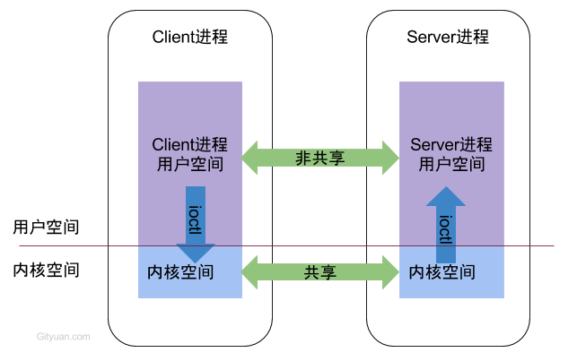
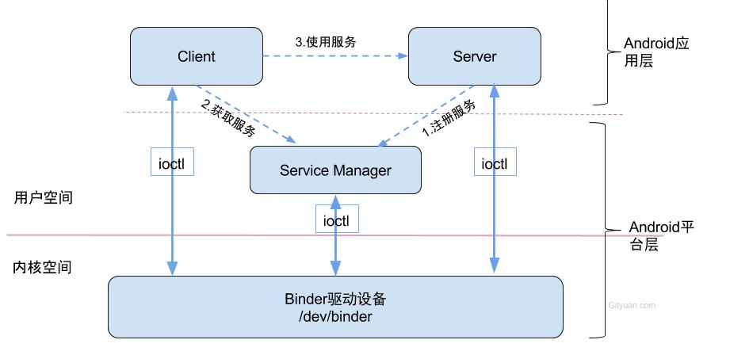
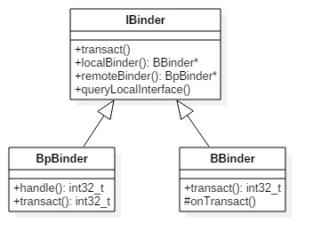

binder

1. 基础概述
android 中多进程的通信都会依赖Binder IPC机制
1.1 IPC原理
从进程的角度看：

每个Android的进程，只能运行在自己进程所拥有的虚拟地址空间。
对应一个4GB的虚拟地址空间，其中3GB是用户空间，1GB是内核空间，当然内核空间的大小是可以通过参数配置调整的。
对于用户空间，不同进程之间彼此是不能共享的，而内核空间却是可共享的。
Client进程向Server进程通信，恰恰是利用进程间可共享的内核内存空间来完成底层通信工作的，Client端与Server端进程往往采用ioctl等方法跟内核空间的驱动进行交互。
1.2 binder原理

可以看出无论是注册服务和获取服务的过程都需要ServiceManager，
需要注意的是此处的Service Manager是指Native层的ServiceManager（C++），并非指framework层的ServiceManager(Java)。
ServiceManager是整个Binder通信机制的大管家，是Android进程间通信机制Binder的守护进程，要掌握Binder机制，
首先需要了解系统是如何首次启动Service Manager。当Service Manager启动之后，Client端和Server端通信时都需要先获取Service Manager接口，才能开始通信服务。
注册服务(addService)：Server进程要先注册Service到ServiceManager。该过程：Server是客户端，ServiceManager是服务端。
获取服务(getService)：Client进程使用某个Service前，须先向ServiceManager中获取相应的Service。该过程：Client是客户端，ServiceManager是服务端。
使用服务：Client根据得到的Service信息建立与Service所在的Server进程通信的通路，然后就可以直接与Service交互。该过程：client是客户端，server是服务端。
1.3 C/S模式
BpBinder(客户端)和BBinder(服务端)都是Android中Binder通信相关的代表，它们都从IBinder类中派生而来，关系图如下：

client端：BpBinder.transact()来发送事务请求；
server端：BBinder.onTransact()会接收到相应事务。


2. ProcessState::self()
```
sp<ProcessState> ProcessState::self()
{
    Mutex::Autolock _l(gProcessMutex);
    if (gProcess != nullptr) {
        return gProcess;
    }
    gProcess = new ProcessState(kDefaultDriver);
    return gProcess;
}
ProcessState::ProcessState(const char *driver)
    : mDriverName(String8(driver))
    , mDriverFD(open_driver(driver))
    , mVMStart(MAP_FAILED)
    , mThreadCountLock(PTHREAD_MUTEX_INITIALIZER)
    , mThreadCountDecrement(PTHREAD_COND_INITIALIZER)
    , mExecutingThreadsCount(0)
    , mMaxThreads(DEFAULT_MAX_BINDER_THREADS)
    , mStarvationStartTimeMs(0)
    , mManagesContexts(false)
    , mBinderContextCheckFunc(nullptr)
    , mBinderContextUserData(nullptr)
    , mThreadPoolStarted(false)
    , mThreadPoolSeq(1)
    , mCallRestriction(CallRestriction::NONE)
{
    if (mDriverFD >= 0) {
        // mmap the binder, providing a chunk of virtual address space to receive transactions.
        //私有的，可读不可写
        mVMStart = mmap(nullptr, BINDER_VM_SIZE, PROT_READ, MAP_PRIVATE | MAP_NORESERVE, mDriverFD, 0);
        if (mVMStart == MAP_FAILED) {
            // *sigh*
            ALOGE("Using %s failed: unable to mmap transaction memory.\n", mDriverName.c_str());
            close(mDriverFD);
            mDriverFD = -1;
            mDriverName.clear();
        }
    }

    LOG_ALWAYS_FATAL_IF(mDriverFD < 0, "Binder driver could not be opened.  Terminating.");
}

ProcessState::~ProcessState()
{
    if (mDriverFD >= 0) {
        if (mVMStart != MAP_FAILED) {
            munmap(mVMStart, BINDER_VM_SIZE);
        }
        close(mDriverFD);
    }
    mDriverFD = -1;
}
```

