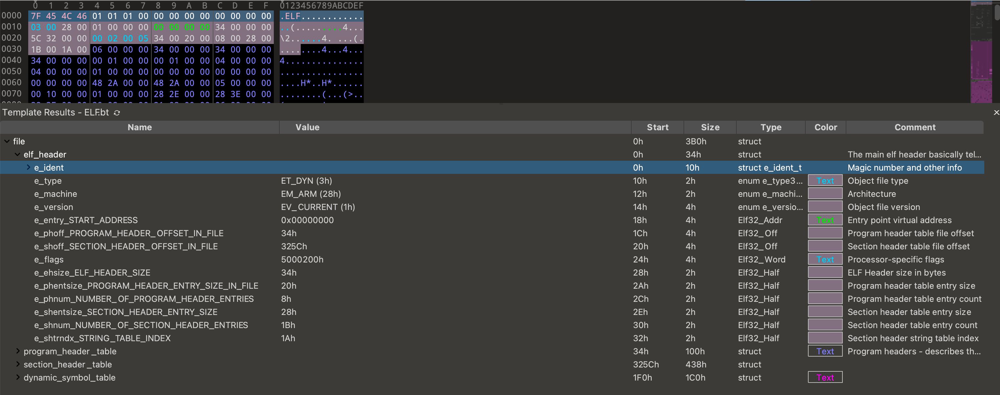
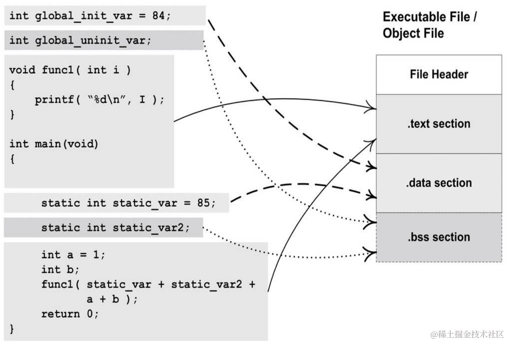
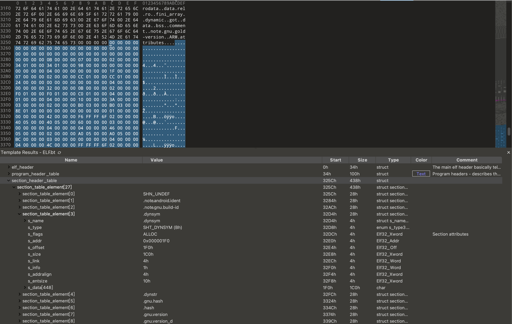
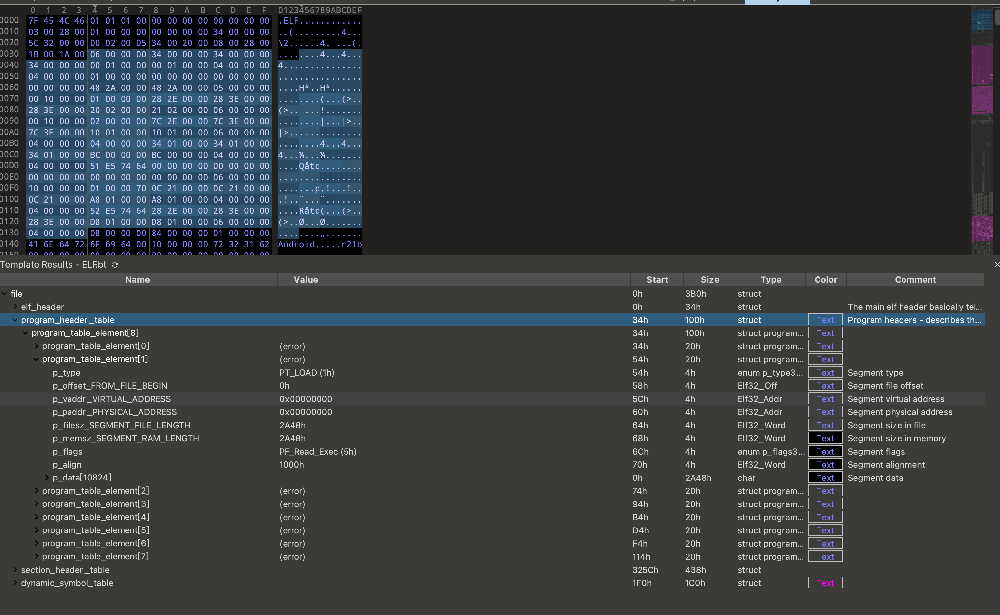

elf解析：
链接视图
section header table

运行视图
programe header table

为什么要有运行视图
1. 相同权限的section 放在一起
2. 如果用section 来加载到内存中，如果这个节的大小为1025KB,内存分页的大小为1024KB,那么多出的1KB空间，需要另外申请一个页，浪费内存


```cpp
/* 32-bit ELF base types. */
typedef __u32	Elf32_Addr;
typedef __u16	Elf32_Half;
typedef __u32	Elf32_Off;
typedef __s32	Elf32_Sword;
typedef __u32	Elf32_Word;

/* 64-bit ELF base types. */
typedef __u64	Elf64_Addr;
typedef __u16	Elf64_Half;
typedef __s16	Elf64_SHalf;
typedef __u64	Elf64_Off;
typedef __s32	Elf64_Sword;
typedef __u32	Elf64_Word;
typedef __u64	Elf64_Xword;
typedef __s64	Elf64_Sxword;

```

以下为定义的文件头：


```cpp
include/uapi/linux/elf.h

#define EI_NIDENT	16

typedef struct elf32_hdr {
  unsigned char	e_ident[EI_NIDENT]; //16字节的魔数等
  Elf32_Half	e_type; //文件类型
  Elf32_Half	e_machine; //需要的体系结构
  Elf32_Word	e_version; //版本
  Elf32_Addr	e_entry;  /* Entry point */
  Elf32_Off	e_phoff;
  Elf32_Off	e_shoff;
  Elf32_Word	e_flags;
  Elf32_Half	e_ehsize; // 表示ELF header 大小 2字节
  Elf32_Half	e_phentsize; // 表示program header table 每个条目的大小
  Elf32_Half	e_phnum; // 表示program header table 包含的条目数
  Elf32_Half	e_shentsize; // 表示section header table 每个条目的大小
  Elf32_Half	e_shnum;    // 表示section header table 包含的条目数
  Elf32_Half	e_shstrndx; //包含section 名称的字符串是第几个
} Elf32_Ehdr;

typedef struct elf64_hdr {
  unsigned char	e_ident[EI_NIDENT];	/* ELF "magic number" */
  Elf64_Half e_type;
  Elf64_Half e_machine;
  Elf64_Word e_version;
  Elf64_Addr e_entry;		/* Entry point virtual address */
  Elf64_Off e_phoff;		/* Program header table file offset */
  Elf64_Off e_shoff;		/* Section header table file offset */
  Elf64_Word e_flags;
  Elf64_Half e_ehsize;
  Elf64_Half e_phentsize;
  Elf64_Half e_phnum;
  Elf64_Half e_shentsize;
  Elf64_Half e_shnum;
  Elf64_Half e_shstrndx;
} Elf64_Ehdr;

```
readelf -h file.so
```r
ELF Header:
  Magic:   7f 45 4c 46 01 01 01 00 00 00 00 00 00 00 00 00
  Class:                             ELF32
  Data:                              2's complement, little endian
  Version:                           1 (current)
  OS/ABI:                            UNIX - System V
  ABI Version:                       0
  Type:                              DYN (Shared object file)
  Machine:                           ARM
  Version:                           0x1
  Entry point address:               0x0
  Start of program headers:          52 (bytes into file)
  Start of section headers:          12892 (bytes into file)
  Flags:                             0x5000200, Version5 EABI, soft-float ABI
  Size of this header:               52 (bytes)
  Size of program headers:           32 (bytes)
  Number of program headers:         8
  Size of section headers:           40 (bytes)
  Number of section headers:         27
  Section header string table index: 26
```

链接视图：
SHT(section header table)
SHT是程序编译链接之后按照功能逻辑组织代码数据的方式，sht位于elf文件的最后
源码编译后生成的不同性质的数据会分门别列的放置，因此出现代码段，数据段，符号段



```cpp
/* sh_type */
#define SHT_NULL	0
#define SHT_PROGBITS	1
#define SHT_SYMTAB	2
#define SHT_STRTAB	3
#define SHT_RELA	4
#define SHT_HASH	5
#define SHT_DYNAMIC	6
#define SHT_NOTE	7
#define SHT_NOBITS	8
#define SHT_REL		9
#define SHT_SHLIB	10
#define SHT_DYNSYM	11
#define SHT_NUM		12
#define SHT_LOPROC	0x70000000
#define SHT_HIPROC	0x7fffffff
#define SHT_LOUSER	0x80000000
#define SHT_HIUSER	0xffffffff

/* sh_flags */
#define SHF_WRITE		0x1
#define SHF_ALLOC		0x2
#define SHF_EXECINSTR		0x4
#define SHF_RELA_LIVEPATCH	0x00100000
#define SHF_RO_AFTER_INIT	0x00200000
#define SHF_MASKPROC		0xf0000000

/* special section indexes */
#define SHN_UNDEF	0
#define SHN_LORESERVE	0xff00
#define SHN_LOPROC	0xff00
#define SHN_HIPROC	0xff1f
#define SHN_LIVEPATCH	0xff20
#define SHN_ABS		0xfff1
#define SHN_COMMON	0xfff2
#define SHN_HIRESERVE	0xffff
 
typedef struct elf32_shdr {
  Elf32_Word	sh_name; //节名
  Elf32_Word	sh_type; //节类型
  Elf32_Word	sh_flags; //节标志位
  Elf32_Addr	sh_addr;  //虚拟地址
  Elf32_Off	sh_offset; //文件偏移地址
  Elf32_Word	sh_size; //节大小
  Elf32_Word	sh_link; 
  Elf32_Word	sh_info;
  Elf32_Word	sh_addralign; //对齐偏移
  Elf32_Word	sh_entsize; 
} Elf32_Shdr;

typedef struct elf64_shdr {
  Elf64_Word sh_name;		/* Section name, index in string tbl */
  Elf64_Word sh_type;		/* Type of section */
  Elf64_Xword sh_flags;		/* Miscellaneous section attributes */
  Elf64_Addr sh_addr;		/* Section virtual addr at execution */
  Elf64_Off sh_offset;		/* Section file offset */
  Elf64_Xword sh_size;		/* Size of section in bytes */
  Elf64_Word sh_link;		/* Index of another section */
  Elf64_Word sh_info;		/* Additional section information */
  Elf64_Xword sh_addralign;	/* Section alignment */
  Elf64_Xword sh_entsize;	/* Entry size if section holds table */
} Elf64_Shdr;
    
```
在 ELF 文件中，`shdr` 是 `Section Header` 的缩写，表示段头表（Section Header Table）中的一项。段头表描述了 ELF 文件中各个段的基本信息，帮助系统在加载或链接时正确处理各个段。

让我们逐一解释 `Elf64_Shdr` 结构体中的各个字段：

1. **`sh_name` (Section name, index in string table)**：
   - 类型：`Elf64_Word`（32位无符号整数）
   - 解释：这是一个指向字符串表的索引，字符串表保存了段的名称。通过该索引，可以找到对应的段名称。
	在段头表中的 sh_name 字段记录了一个索引值。
	该索引值对应于 .shstrtab 段中的偏移量。
	在 .shstrtab 段中，从该偏移量开始的字符串就是该段的名称。

2. **`sh_type` (Type of section)**：
   - 类型：`Elf64_Word`（32位无符号整数）
   - 解释：该字段表示段的类型，常见的类型有：
     - `SHT_NULL`：空段
     - `SHT_PROGBITS`：程序数据段
     - `SHT_SYMTAB`：符号表段
     - `SHT_STRTAB`：字符串表段
     - `SHT_RELA`：带重定位的符号段等

3. **`sh_flags` (Miscellaneous section attributes)**：
   - 类型：`Elf64_Xword`（64位无符号整数）
   - 解释：段的属性标志，可能的标志有：
     - `SHF_WRITE`：段包含可写数据
     - `SHF_ALLOC`：段需要被加载到内存中
     - `SHF_EXECINSTR`：段包含可执行指令

4. **`sh_addr` (Section virtual addr at execution)**：
   - 类型：`Elf64_Addr`（64位无符号整数）
   - 解释：段在内存中的虚拟地址。如果段需要被加载到内存中（如代码段或数据段），该地址表示它在进程地址空间中的位置。对于非加载段，这个值为 0。

5. **`sh_offset` (Section file offset)**：
   - 类型：`Elf64_Off`（64位无符号整数）
   - 解释：段在文件中的偏移量，指明该段数据从文件的哪个位置开始。

6. **`sh_size` (Size of section in bytes)**：
   - 类型：`Elf64_Xword`（64位无符号整数）
   - 解释：段的大小，以字节为单位。

7. **`sh_link` (Index of another section)**：
   - 类型：`Elf64_Word`（32位无符号整数）
   - 解释：此字段与段的类型相关。对于符号表，它通常是关联字符串表的索引；对于重定位段，它可能是关联符号表的索引。

8. **`sh_info` (Additional section information)**：
   - 类型：`Elf64_Word`（32位无符号整数）
   - 解释：该字段也与段类型相关。例如，对于符号表，它表示局部符号的起始索引；对于重定位段，它可能是相关节的索引。

9. **`sh_addralign` (Section alignment)**：
   - 类型：`Elf64_Xword`（64位无符号整数）
   - 解释：段的对齐要求。段必须按此对齐方式在内存中对齐。如果对齐值为 0 或 1，则表示没有特殊对齐要求。

10. **`sh_entsize` (Entry size if section holds table)**：
    - 类型：`Elf64_Xword`（64位无符号整数）
    - 解释：如果段包含一个表（如符号表或重定位表），此字段指明每个表项的大小。如果段不是表，则此字段为 0。

这些字段共同描述了每个段的基本属性，使操作系统或链接器能够正确处理 ELF 文件中的各个段。


连接器相关的 .dynamic section

**`.dynamic` 段** 在 ELF 文件中是一个非常重要的段，它用于描述可执行文件或共享对象文件在运行时与动态链接器之间的互动。它包含了与动态链接相关的各种信息，比如所依赖的共享库、全局偏移表（GOT）、符号表、重定位表等。

`.dynamic` 段的内容是由一系列 `Elf64_Dyn` 结构体组成的。每个 `Elf64_Dyn` 结构体有两个成员，分别是 `d_tag` 和 `d_un`，其中 `d_tag` 指定了动态条目的类型，而 `d_un` 则包含相应的值或地址。

`Elf64_Dyn` 结构体的定义如下：

```c
typedef struct {
    Elf64_Sxword d_tag;     /* Dynamic entry type */
    union {
        Elf64_Xword d_val;  /* Integer value */
        Elf64_Addr d_ptr;   /* Program virtual address */
    } d_un;
} Elf64_Dyn;
```

### 详细介绍 `.dynamic` 段的常用标志（`d_tag` 字段）

每个动态条目（entry）的 `d_tag` 字段表示该条目的类型，`d_un` 存储的值可能是一个整数（`d_val`）或者是一个虚拟地址（`d_ptr`）。以下是 `.dynamic` 段中常用的标志及其含义：

1. **`DT_NEEDED`**
   - 解释：指向依赖的共享库名称的字符串表索引。每个 `DT_NEEDED` 条目指定了一个程序运行时所需的共享库。
   - 类型：`d_un.d_val` 指向字符串表中的索引。

2. **`DT_PLTRELSZ`**
   - 解释：`.rel.plt` 或 `.rela.plt` 段的大小，即重定位表的大小，主要用于跳转表（PLT）。
   - 类型：`d_un.d_val` 是段的大小（以字节为单位）。

3. **`DT_PLTGOT`**
   - 解释：全局偏移表（Global Offset Table, GOT）的地址。GOT 是用于处理动态符号解析的一个数据结构。
   - 类型：`d_un.d_ptr` 是 GOT 段的虚拟地址。

4. **`DT_HASH`**
   - 解释：指向符号哈希表的地址。用于符号查找加速。
   - 类型：`d_un.d_ptr` 是哈希表的虚拟地址。

5. **`DT_STRTAB`**
   - 解释：指向字符串表的地址。字符串表保存符号名、库名等。
   - 类型：`d_un.d_ptr` 是字符串表的虚拟地址。

6. **`DT_SYMTAB`**
   - 解释：指向符号表的地址。符号表保存了符号（如函数、变量）的地址和类型信息。
   - 类型：`d_un.d_ptr` 是符号表的虚拟地址。

7. **`DT_RELA`**
   - 解释：指向带加法重定位表（`.rela` 段）的地址。
   - 类型：`d_un.d_ptr` 是 `.rela` 重定位表的虚拟地址。

8. **`DT_RELASZ`**
   - 解释：`.rela` 段的大小（以字节为单位）。
   - 类型：`d_un.d_val` 是段的大小。

9. **`DT_STRSZ`**
   - 解释：字符串表的大小（以字节为单位）。
   - 类型：`d_un.d_val` 是字符串表的大小。

10. **`DT_SYMENT`**
    - 解释：符号表中每个条目的大小（以字节为单位）。
    - 类型：`d_un.d_val` 是符号表条目的大小。

11. **`DT_INIT`**
    - 解释：程序或共享库初始化函数的地址。当程序启动或共享库被加载时，该函数会被调用。
    - 类型：`d_un.d_ptr` 是初始化函数的地址。

12. **`DT_FINI`**
    - 解释：程序或共享库的终止函数的地址。当程序退出或共享库被卸载时，该函数会被调用。
    - 类型：`d_un.d_ptr` 是终止函数的地址。

13. **`DT_REL`**
    - 解释：指向不带加法重定位表（`.rel` 段）的地址。
    - 类型：`d_un.d_ptr` 是 `.rel` 段的虚拟地址。

14. **`DT_RELSZ`**
    - 解释：`.rel` 段的大小（以字节为单位）。
    - 类型：`d_un.d_val` 是 `.rel` 段的大小。

15. **`DT_JMPREL`**
    - 解释：指向 `.rel.plt` 或 `.rela.plt` 段中的跳转表的重定位条目的地址。
    - 类型：`d_un.d_ptr` 是 `.rel.plt` 或 `.rela.plt` 段的虚拟地址。

16. **`DT_BIND_NOW`**
    - 解释：指示动态链接器立即解析所有符号，而不是按需解析。这通常用于提高运行时性能。
    - 类型：此标志仅用作指示（无关联值）。

17. **`DT_DEBUG`**
    - 解释：用于调试信息，动态链接器可以将一些调试相关信息放入此字段。
    - 类型：`d_un.d_ptr` 是指向调试信息结构的虚拟地址。

18. **`DT_FLAGS`**
    - 解释：用于表示一些与动态链接相关的标志。常见标志包括：
        - `DF_ORIGIN`：允许使用 `$ORIGIN` 来解析动态库路径。
        - `DF_SYMBOLIC`：优先使用定义在可执行文件中的符号，而非动态库中的符号。
        - `DF_TEXTREL`：允许对只读段进行重定位（通常意味着不安全的代码）。
        - `DF_BIND_NOW`：所有符号都应立即绑定，而不是延迟到运行时。

19. **`DT_RUNPATH`**
    - 解释：运行时库搜索路径的地址。它提供了一个库搜索路径，动态链接器将在这个路径中查找所需的共享库。
    - 类型：`d_un.d_ptr` 是运行时路径字符串的地址。

20. **`DT_SONAME`**
    - 解释：共享库的名字。动态链接器会使用这个名字来查找库文件。
    - 类型：`d_un.d_val` 是字符串表中的索引，指向共享库名。

21. **`DT_RPATH`**
    - 解释：指定库搜索路径，类似于 `DT_RUNPATH`，但优先级不同。`RPATH` 通常在老版本中使用，`RUNPATH` 更现代。
    - 类型：`d_un.d_ptr` 是运行时库路径字符串的地址。

### 总结

`.dynamic` 段是 ELF 文件中用于动态链接的核心结构，它包含了动态链接器在加载时所需的各种信息。每个 `d_tag` 对应不同类型的动态条目，链接器通过这些条目来处理库依赖、符号解析、重定位等工作。

```r
There are 27 section headers, starting at offset 0x325c:

Section Headers:
  [Nr] Name              Type            Addr     Off    Size   ES Flg Lk Inf Al
  [ 0]                   NULL            00000000 000000 000000 00      0   0  0
  [ 1] .note.androi[...] NOTE            00000134 000134 000098 00   A  0   0  4
  [ 2] .note.gnu.bu[...] NOTE            000001cc 0001cc 000024 00   A  0   0  4
  [ 3] .dynsym           DYNSYM          000001f0 0001f0 0001c0 10   A  4   1  4
  [ 4] .dynstr           STRTAB          000003b0 0003b0 00018e 00   A  0   0  1
  [ 5] .gnu.hash         GNU_HASH        00000540 000540 000060 04   A  3   0  4
  [ 6] .hash             HASH            000005a0 0005a0 0000bc 04   A  3   0  4
  [ 7] .gnu.version      VERSYM          0000065c 00065c 000038 02   A  3   0  2
  [ 8] .gnu.version_d    VERDEF          00000694 000694 00001c 00   A  4   1  4
  [ 9] .gnu.version_r    VERNEED         000006b0 0006b0 000040 00   A  4   2  4
  [10] .rel.dyn          REL             000006f0 0006f0 000178 08   A  3   0  4
  [11] .rel.plt          REL             00000868 000868 000080 08  AI  3  20  4
  [12] .plt              PROGBITS        000008e8 0008e8 0000d4 00  AX  0   0  4
  [13] .text             PROGBITS        000009bc 0009bc 001750 00  AX  0   0  4
  [14] .ARM.exidx        ARM_EXIDX       0000210c 00210c 0001a8 08  AL 13   0  4
  [15] .ARM.extab        PROGBITS        000022b4 0022b4 000198 00   A  0   0  4
  [16] .rodata           PROGBITS        0000244c 00244c 0005fc 01 AMS  0   0  1
  [17] .data.rel.ro      PROGBITS        00003e28 002e28 00004c 00  WA  0   0  4
  [18] .fini_array       FINI_ARRAY      00003e74 002e74 000008 04  WA  0   0  4
  [19] .dynamic          DYNAMIC         00003e7c 002e7c 000110 08  WA  4   0  4
  [20] .got              PROGBITS        00003f8c 002f8c 000074 00  WA  0   0  4
  [21] .data             PROGBITS        00004000 003000 000048 00  WA  0   0  4
  [22] .bss              NOBITS          00004048 003048 000001 00  WA  0   0  1
  [23] .comment          PROGBITS        00000000 003048 0000b6 01  MS  0   0  1
  [24] .note.gnu.go[...] NOTE            00000000 003100 00001c 00      0   0  4
  [25] .ARM.attributes   ARM_ATTRIBUTES  00000000 00311c 00002e 00      0   0  1
  [26] .shstrtab         STRTAB          00000000 00314a 00010f 00      0   0  1
Key to Flags:
  W (write), A (alloc), X (execute), M (merge), S (strings), I (info),
  L (link order), O (extra OS processing required), G (group), T (TLS),
  C (compressed), x (unknown), o (OS specific), E (exclude),
  D (mbind), y (purecode), p (processor specific)
```
各个节的解释：
https://naotu.baidu.com/file/953beb87c9258f4111f4c105ed03c36e


运行视图：
PHT
program header table
其存在，使得操作系统加载程序时尽可能少的产生内存碎片，尽可能的提高内存使用率。



```cpp
/* These constants define the permissions on sections in the program
   header, p_flags. */
#define PF_R		0x4
#define PF_W		0x2
#define PF_X		0x1

typedef struct elf32_phdr {
  Elf32_Word	p_type;
  Elf32_Off	p_offset;
  Elf32_Addr	p_vaddr;
  Elf32_Addr	p_paddr;
  Elf32_Word	p_filesz;
  Elf32_Word	p_memsz;
  Elf32_Word	p_flags;
  Elf32_Word	p_align;
} Elf32_Phdr;

typedef struct elf64_phdr {
  Elf64_Word p_type;
  Elf64_Word p_flags;
  Elf64_Off p_offset;		/* Segment file offset */
  Elf64_Addr p_vaddr;		/* Segment virtual address */
  Elf64_Addr p_paddr;		/* Segment physical address */
  Elf64_Xword p_filesz;		/* Segment size in file */
  Elf64_Xword p_memsz;		/* Segment size in memory */
  Elf64_Xword p_align;		/* Segment alignment, file & memory */
} Elf64_Phdr;
```
在 ELF 文件中，`phdr` 是 **Program Header**（程序头表）的缩写，描述了可执行文件或共享对象文件的段（segment）信息。与段头表（Section Header）不同，程序头表用于加载时描述如何在内存中布置文件的各个段。

让我们逐一解释 `Elf64_Phdr` 结构体中的各个字段：

1. **`p_type`** (Segment type):
   - 类型：`Elf64_Word`（32位无符号整数）
   - 解释：指明该段的类型，常见的值包括：
     - `PT_NULL`：未使用的段
     - `PT_LOAD`：可加载段
     - `PT_DYNAMIC`：动态链接信息段
     - `PT_INTERP`：包含解释器路径的段
     - `PT_NOTE`：包含注释的段

2. **`p_flags`** (Segment flags):
   - 类型：`Elf64_Word`（32位无符号整数）
   - 解释：段的权限标志，可能的标志包括：
     - `PF_R`：可读段
     - `PF_W`：可写段
     - `PF_X`：可执行段
   这些标志决定了段在内存中的访问权限。

3. **`p_offset`** (Segment file offset):
   - 类型：`Elf64_Off`（64位无符号整数）
   - 解释：该段在文件中的偏移量，指明该段数据从文件的哪个位置开始。

4. **`p_vaddr`** (Segment virtual address):
   - 类型：`Elf64_Addr`（64位无符号整数）
   - 解释：段在内存中的虚拟地址。在加载时，系统会将该段加载到进程的这个虚拟地址处。

5. **`p_paddr`** (Segment physical address):
   - 类型：`Elf64_Addr`（64位无符号整数）
   - 解释：段的物理地址，主要用于与硬件相关的系统中。在大多数操作系统中，这个值通常与 `p_vaddr` 相同或者不使用。

6. **`p_filesz`** (Segment size in file):
   - 类型：`Elf64_Xword`（64位无符号整数）
   - 解释：段在文件中的大小，以字节为单位。

7. **`p_memsz`** (Segment size in memory):
   - 类型：`Elf64_Xword`（64位无符号整数）
   - 解释：段在内存中的大小，以字节为单位。`p_memsz` 可以比 `p_filesz` 大，这种情况通常发生在 BSS 段（未初始化的数据段），在内存中需要占用更多空间，但在文件中不占用空间。

8. **`p_align`** (Segment alignment):
   - 类型：`Elf64_Xword`（64位无符号整数）
   - 解释：该段在文件和内存中的对齐要求。值为 0 或 1 表示不需要特殊对齐；否则，它必须是 2 的幂，段的文件偏移和内存地址必须符合该对齐要求。

这些字段共同描述了每个程序段的基本属性，帮助系统在执行时正确加载并映射 ELF 文件的各个段。
readelf -l file.so
```cpp
Elf file type is DYN (Shared object file)
Entry point 0x0
There are 8 program headers, starting at offset 52

Program Headers:
  Type           Offset   VirtAddr   PhysAddr   FileSiz MemSiz  Flg Align
  PHDR           0x000034 0x00000034 0x00000034 0x00100 0x00100 R   0x4
  LOAD           0x000000 0x00000000 0x00000000 0x02a48 0x02a48 R E 0x1000
  LOAD           0x002e28 0x00003e28 0x00003e28 0x00220 0x00221 RW  0x1000
  DYNAMIC        0x002e7c 0x00003e7c 0x00003e7c 0x00110 0x00110 RW  0x4
  NOTE           0x000134 0x00000134 0x00000134 0x000bc 0x000bc R   0x4
  GNU_STACK      0x000000 0x00000000 0x00000000 0x00000 0x00000 RW  0x10
  EXIDX          0x00210c 0x0000210c 0x0000210c 0x001a8 0x001a8 R   0x4
  GNU_RELRO      0x002e28 0x00003e28 0x00003e28 0x001d8 0x001d8 RW  0x4

 Section to Segment mapping:
  Segment Sections...
   00
   01     .note.android.ident .note.gnu.build-id .dynsym .dynstr .gnu.hash .hash .gnu.version .gnu.version_d .gnu.version_r .rel.dyn .rel.plt .plt .text .ARM.exidx .ARM.extab .rodata
   02     .data.rel.ro .fini_array .dynamic .got .data .bss
   03     .dynamic
   04     .note.android.ident .note.gnu.build-id
   05
   06     .ARM.exidx
   07     .data.rel.ro .fini_array .dynamic .got
```


在 Android 6.0（API Level 23）之后，系统开始严格禁止 .so 文件中的 文本重定位（Text Relocations）

1. 什么是文本重定位（Text Relocations）？

	•	文本重定位指的是修改共享库代码段（通常被标记为只读）的内存地址，以便让其与实际加载的地址一致。
	•	通常，编译 .so 文件时会生成位置无关代码（Position-Independent Code, PIC），这样生成的代码就能在运行时被加载到任何可用的内存地址，而无需修改代码段的内容。
	•	但如果 .so 文件不支持位置无关代码，系统在加载时必须对其进行文本重定位，即修改代码段内的指令，以使其与实际的内存地址匹配。

2. 为什么 Android 6.0 之后禁止文本重定位？

	•	安全性: 文本重定位需要将代码段设为可写（writable），这违反了现代操作系统的安全原则，即代码段应是只读的，以防止恶意代码注入和利用漏洞进行攻击。文本重定位带来了潜在的安全漏洞，可能被恶意程序利用进行代码注入。
	•	性能: 文本重定位会增加启动时的开销，因为系统需要在加载 .so 文件时对其进行修改。而且，这会导致共享库无法共享相同的物理内存页面，增加内存占用，降低性能。
	•	更好的内存管理: 禁止文本重定位有助于 Android 系统实现更高效的内存管理，避免在多进程中加载相同 .so 文件时因为重定位而导致的内存浪费。

3. 禁止文本重定位后，.so 文件的加载行为

	•	禁止文本重定位后，系统要求 .so 文件必须是 位置无关代码（PIC），这意味着它可以加载到任何可用的内存地址，而不需要修改代码段的内容。
	•	只要 .so 文件是用位置无关代码编译的（即 -fPIC 编译选项），它就可以在运行时加载到内存的任何地址，而不需要文本重定位。因此，Android 6.0 之后的 .so 文件并不会被加载到固定地址，而是由系统动态分配可用的内存地址。

文本重定向代码分析
这段代码来自于动态链接器的部分，主要用于处理 **动态段** 中的 `DT_TEXTREL` 标签。`DT_TEXTREL` 是 ELF 动态段（`.dynamic` 段）中的一个标识符，它表明该可执行文件或共享库（`.so` 文件）存在 **文本重定位（text relocations）**。文本重定位指的是在程序加载时，需要修改代码段（`.text` 段）中的内容来调整符号地址。

### 代码分析
```c
typedef struct {
    Elf64_Sxword d_tag;     /* Dynamic entry type */
    union {
        Elf64_Xword d_val;  /* Integer value */
        Elf64_Addr d_ptr;   /* Program virtual address */
    } d_un;
} Elf64_Dyn;
```

```cpp
case DT_TEXTREL:
#if defined(__LP64__)
    DL_ERR("\"%s\" has text relocations", get_realpath());
    return false;
#else
    has_text_relocations = true;
    break;
#endif
```

1. **`case DT_TEXTREL:`**:
   - 这是在动态链接器中解析动态段（`.dynamic` 段）时的一个 `switch` 语句分支，处理 `DT_TEXTREL` 的场景。
   - `DT_TEXTREL` 表示该共享库或可执行文件存在需要重定位的 `.text` 段，即代码段包含绝对地址引用，加载时需要动态修改。

2. **`#if defined(__LP64__)`**:
   - 这是一个 **条件编译宏**，用于检查当前系统是否是 **64 位架构**。`__LP64__` 是 GCC 或 Clang 编译器定义的一个宏，用来标识编译环境为 64 位的长指针模型（LP64 模型），即 `long` 和 `pointer` 类型在 64 位系统中为 64 位。
   - **LP64 架构**: 在 64 位系统上，代码中的指针和 `long` 类型通常为 64 位。64 位系统通常强制要求 **代码段不可修改**，因为允许修改 `.text` 段可能带来安全风险。

3. **`DL_ERR("\"%s\" has text relocations", get_realpath());`**:
   - 如果程序运行在 64 位架构上，并且发现 `.so` 文件中存在 `DT_TEXTREL`，动态链接器会调用 `DL_ERR` 函数打印错误信息。这里的 `get_realpath()` 用于获取当前正在处理的共享库的真实路径，并将其作为错误信息输出。
   - 错误信息内容：`"filename has text relocations"`，表示当前文件存在文本重定位。

4. **`return false;`**:
   - 对于 64 位系统，一旦发现 `.so` 文件有文本重定位，动态链接器立即返回 `false`，表示拒绝加载该文件。这是因为现代 64 位系统通常禁止修改 `.text` 段以确保安全性，避免代码注入等攻击。

5. **`#else` 分支**:
   - 如果程序运行在 32 位架构上（即没有定义 `__LP64__`），动态链接器不会立即拒绝加载文件，而是将 `has_text_relocations` 变量设置为 `true`。
   - 在 32 位系统上，尽管 `.text` 段的重定位被认为是不安全的，但仍然是被允许的，因此不会直接报错，而是继续加载该共享库。

6. **`has_text_relocations = true;`**:
   - 在 32 位系统上，动态链接器设置一个标志 `has_text_relocations` 为 `true`，记录当前 `.so` 文件有文本重定位。在后续的加载流程中，动态链接器可能会针对这个标志执行特殊处理，比如发出警告或做额外的安全检查。

### 代码逻辑总结

- **64 位系统（`__LP64__`）**:
   - 如果当前系统是 64 位系统，并且该 `.so` 文件存在文本重定位 (`DT_TEXTREL`)，系统会直接报错，并拒绝加载该文件。这是因为现代 64 位系统严格要求代码段不可修改，以提高安全性。

- **32 位系统（非 `__LP64__`）**:
   - 如果当前系统是 32 位系统，虽然存在文本重定位，动态链接器仍然允许加载该文件，但会记录 `has_text_relocations = true`，表明这个文件有文本重定位。32 位系统的安全性要求较低，历史上允许文本重定位以支持不使用位置无关代码（PIC）的库。

### 为什么 64 位系统不允许 Text Relocations？

1. **安全性考虑**:
   - 允许 `.text` 段可写会带来安全风险，攻击者可以利用这个机制修改代码段，进行代码注入等恶意攻击。
   - 在 64 位系统上，严禁 `.text` 段的修改可以有效防止这类攻击。

2. **现代系统的内存管理和性能优化**:
   - 现代 64 位系统采用了更高级的内存管理和优化技术，`.text` 段通常是共享的内存页。如果允许修改 `.text` 段，会导致每个进程必须拥有自己独立的内存页，增加内存占用，破坏共享机制。
   - 禁止文本重定位有助于提高性能和减少内存占用。

### 总结

这段代码检查动态库是否存在 `DT_TEXTREL`（文本重定位）标签。在 64 位系统中，检测到文本重定位后，动态链接器会拒绝加载该 `.so` 文件并抛出错误，而在 32 位系统中，虽然允许文本重定位，但会设置标志 `has_text_relocations` 为 `true`，以便后续做相应的处理。这种区别源于 64 位系统对安全性和性能的更高要求。

#define DT_TEXTREL	22

00 00 00 03