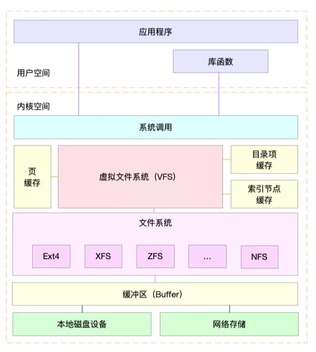
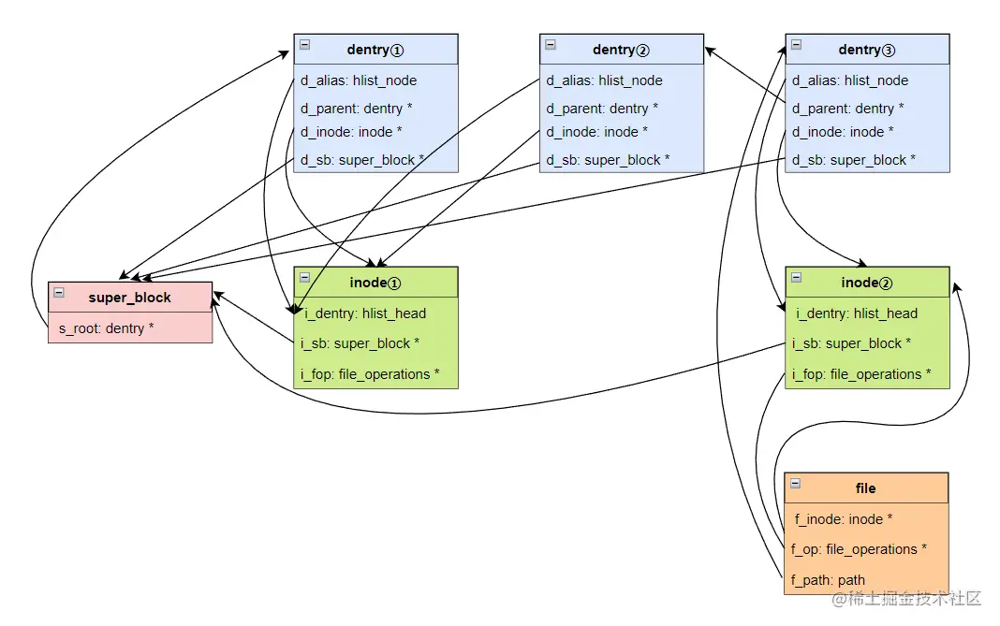

title:  VFS 学习
date: 2023-01-25 16:55:12
tags:
---
# VFS

怎么让很多的软件进程同时使用这些外置存储设备，而不会乱呢？直接基于物理的存储地址进行读写肯定是行不通的，过上几个月你自己可能都不记得什么数据写到哪里了。所以和内存管理不同，外部存储的管理，我们希望这些写到存储中的数据是“自描述”的某种数据格式，我们可以随时查看之前写了哪些内容，都什么时候写的。这就是文件系统的来源。

存储它不应该只能保存一个文件，而是应该是多个。既然是多个，就需要组织这些文件。那么，怎么组织呢？操作系统的设计者们设计了文件系统这样的东西，来组织这些文件。虽然文件系统的种类有很多（比如：FAT32、NTFS、EXT3、EXT4 等等），但是它们有统一的抽象：文件系统是一颗树；节点要么是目录，要么是文件；文件必然是叶节点；根节点是目录，目录可以有子节点。
文件系统以文件和树形目录的抽象逻辑概念代替了硬盘和光盘等物理设备中的数据块的概念，用户使用文件系统来保存数据时，只需要知道文件路径而不必关心数据实际保存在硬盘的数据块地址。设备上存储空间的分配和释放由文件系统自动完成，用户只需要记住数据被存入哪个文件即可。

## IO 栈
我们习惯了网络协议栈，但很少提io栈。请描述一下文件的 io 栈？

IO 从用户态走系统调用进到内核，内核的路径：VFS → 文件系统 → 块层 → SCSI 层 。
VFS （ Virtual File System 、Virtual FileSystem Switch ）层是 Linux 针对文件概念封装的一层通用逻辑，它做的事情其实非常简单，就是把所有文件系统的共性的东西抽象出来，比如 file ，inode ，dentry 等结构体，针对这些结构体抽象出通用的 api 接口，然后具体的文件系统则只需要按照接口去实现这些接口即可，在 IO 下来的时候，VFS 层使用到文件所在的文件系统的对应接口。它的作用：为上层抽象统一的操作界面，在 IO 路径上切换不同的文件系统。
文件系统，对上抽象一个文件的概念，把数据按照策略存储到块设备上。文件系统管理的是一个线性的空间（分区，块设备），而用户看到的却是文件的概念，这一层的转化就是文件系统来做的。它负责把用户的数据按照自己制定的规则存储到块设备上。比如是按照 4K 切块存，还是按照 1M 切块存储，这些都是文件系统自己说了算。它这一层就是做了一层空间的映射转化，文件的虚拟空间到实际线性设备的映射。这层映射最关键的是 address_space 相关的接口来做。
块层，块层其实在真实的硬件之上又抽象了一层，屏蔽不同的硬件驱动，块设备看起来就是一个线性空间而已。块层主要还是 IO 调度策略的实现，尽可能收集批量 IO 聚合下发，让 IO 尽可能的顺序，合并 IO 请求减少 IO 次数等等；划重点：块层主要做的是 IO 调度策略的一些优化。比如最出名的电梯算法就是在这里。Linux 块层 IO 子系统
SCSI 层，SCSI 层这个就不用多说了，这个就是硬件的驱动而已，本质就是个翻译器。SCSI 层里面按照细分又会细分多层出来。它是给你的磁盘做最后一道程序，SCSI 层负责和磁盘硬件做转换，IO 交给它就能顺利的到达磁盘硬件。
## 进程与文件系统
进程的文件位置等信息（当前目录等）是由fs_struct 来描述的
```
//file:include/linux/fs_struct.h
struct fs_struct {
	int users;
	spinlock_t lock;
	seqcount_spinlock_t seq;
	int umask;
	int in_exec;
	struct path root, pwd;
} __randomize_layout;
//file:include/linux/path.h
struct path {
	struct vfsmount *mnt;
	struct dentry *dentry;
} __randomize_layout;
```
进程打开的文件信息：每个进程用一个files_struct 结构来记录文件描述符的使用情况
```
struct files_struct {
  /*
   * read mostly part
   */
	atomic_t count;
	bool resize_in_progress;
	wait_queue_head_t resize_wait;

	struct fdtable __rcu *fdt; //fdtable 
	struct fdtable fdtab;
  /*
   * written part on a separate cache line in SMP
   */
	spinlock_t file_lock ____cacheline_aligned_in_smp;
	unsigned int next_fd; //下一个要分配的文件句柄号
	unsigned long close_on_exec_init[1];
	unsigned long open_fds_init[1];
	unsigned long full_fds_bits_init[1];
	struct file __rcu * fd_array[NR_OPEN_DEFAULT];
};

struct fdtable {
	unsigned int max_fds;
	struct file __rcu **fd;      /* current fd array */ //当前文件数组
	unsigned long *close_on_exec;
	unsigned long *open_fds;
	unsigned long *full_fds_bits;
	struct rcu_head rcu;
};
```
fdtable.fd数组的下标就是文件描述符，其中 0、1、2 三个描述符总是默认分配给标准输入、标准输出和标准错误。在数组元素中记录了当前进程打开的每一个文件的指针。这个文件是 Linux 中抽象的文件，可能是真的磁盘上的文件，也可能是一个 socket。

## vfs


文件系统为应用程序提供了一个逻辑视图，具体是一棵倒立的树结构，方便用户管理众多文件。
内部实现：Linux 对超级块结构/superblock、目录结构/dentry，inode 结构以及数据块做了抽象，把这些结构加入了操作函数集合，形成了 VFS，即虚拟文件系统。只要软件模块能提供上述四大核心结构的操作函数集合，生成超级块结构，就可以形成一个文件系统实例，安装到 VFS 中。有了 VFS 层就可以向上为应用程序提供统一的接口，向下兼容不同的文件系统，让 Linux 能够同时安装不同的文件系统。

### vfs 的基本概念

VFS有四大对象：super_block、dentry、inode和file，贯穿了VFS的设计。

* super_block：超级块。存放挂载的文件系统的相关信息，挂载Binder文件系统到全局文件系统树时，会创建属于它的super_block。
* dentry：目录项。文件系统将目录也当作文件，目录的数据由目录项组成，而每个目录项存储一个目录或文件的名称、对应的inode等内容。open一个文件"/home/xxx/yyy.txt"，那么/、home、xxx、yyy.txt都是一个文件路径组件（组件这词主要来自源码中的component），都有一个对应的dentry。
* inode：索引节点。描述磁盘上的一个文件元数据（文件属性、位置等）。
* file：文件对象。open()时创建，close()时销毁。open一个文件/home/xxx/yyy.txt，会用file来记录yyy.txt对应的inode、dentry以及file_operations。


* 一个文件系统中，只会有一个super_block。
* dentry中有指向super_block的指针，即d_sb。dentry中有指向它对应的inode的指针，即d_inode。dentry中有指向它的父dentry的指针，即d_parent。
* 多个dentry能会指向同一个inode。不同的dentry可能是同一个inode的别名，inode里有个i_dentry字段，它是一个链表，链表的节点是dentry里的d_alias。当持有一个inode对象时，利用i_dentry和d_adlias，我们可以通过container_of获取到对应的dentry。详见d_find_alias()。//这个改怎么理解
* inode中有指向super_block的指针，即i_sb。
* file中有指向对应的inode的指针，即f_inode。file里的f_path是结构体path的对象，它记录了指向对应的dentry的指针。
* file中的f_op，通常等价于对应的inode的i_fop。f_op是结构体file_operations的对象，记录着一些函数指针，代表系统调用open()的目标文件所支持的操作，比如open()、read()、write()等。

### vfs的挂载


